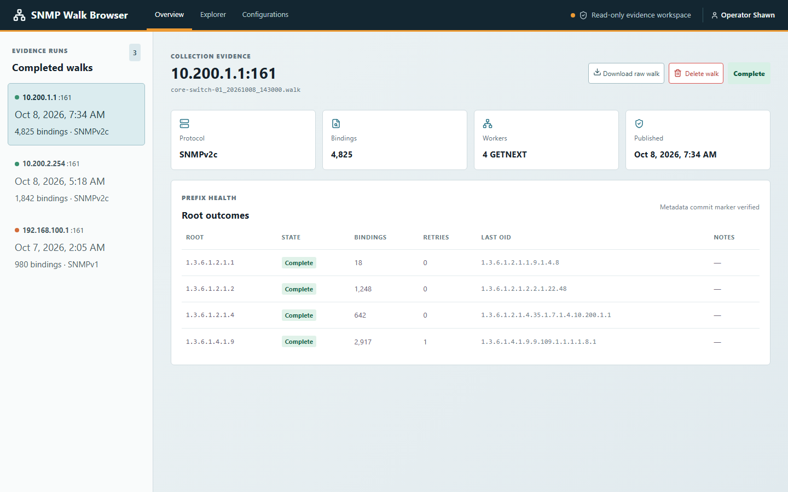
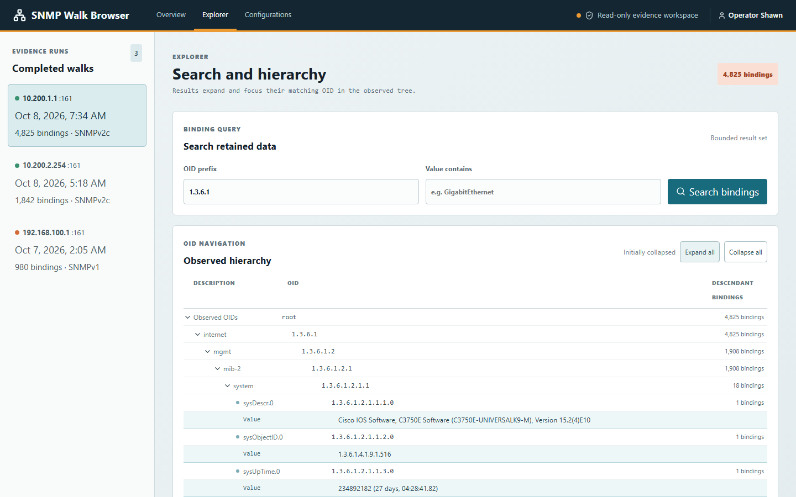
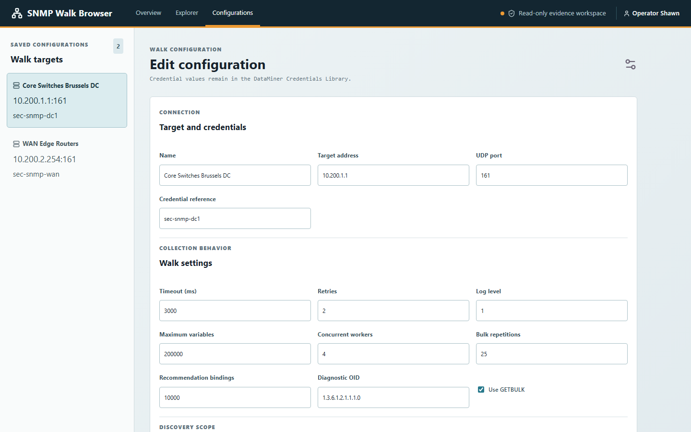

# SNMP Walk Collector and Explorer

DataMiner Automation components for collecting SNMP walk evidence and inspecting completed runs in a browser.



### Screen Captures

| Completed Runs & Evidence Overview | OID Hierarchy & Binding Search | Saved Walk Configurations |
| :---: | :---: | :---: |
|  |  |  |

## Components

- **Collector**: probes SNMPv1 and SNMPv2c, walks configured non-overlapping numeric OID roots, and writes immutable JSON Lines evidence with a metadata commit marker.
- **Explorer bridge**: a non-interactive Automation script that exposes completed evidence bundles and saved non-secret configuration records to the authenticated browser session.
- **Explorer browser**: displays root outcomes, a bounded OID hierarchy, binding search, raw-evidence download, and saved configuration records.

## Prerequisites

- DataMiner `10.6.0.0-17344` or later for the combined Explorer package.
- The QA Device Simulator library installed with DataMiner at `C:\Skyline DataMiner\Tools\QADeviceSimulator\Skyline.DataMiner.QA.SNMP.dll` on every DMA that runs the collector. Verify that the file exists; no separate QA Simulator installer is required.
- Node.js 22 or later when building the Explorer package from source.

## Build and Test

```powershell
Set-Location SLC-S-SNMPWalkBrowser
npm ci
npm run lint
npm run build
npm run test:e2e

Set-Location ..
dotnet build .\SLC-S-SNMPWalkExplorer.slnx -c Release --warnaserror
dotnet test .\SLC-S-SNMPWalkCollector.Tests\SLC-S-SNMPWalkCollector.Tests.csproj -c Release --no-build
```

The combined package is produced at `SLC-S-SNMPWalkExplorer.Package\bin\Release\net48\DataMinerBuild\`.

## Deploy

Install the combined Explorer `.dmapp` on the target DMA. Open the browser through the DataMiner authentication entry point:

```text
{PROTOCOL}://{DOMAIN}/auth/?url=%2Fpublic%2FSLC-S-SNMPWalkBrowser%2Findex.html
```

The browser calls the packaged `SLC-S-SNMPWalkExplorer.Bridge` Automation script through DataMiner's authenticated browser API. It saves non-secret configuration records in DOM and reads committed evidence identified by artifact ID:

- **Executing a walk**: From the **Configurations** tab, select a saved target and click **Execute walk**. Enter the SNMP community string at the prompt. The bridge launches the collector script asynchronously in the background on the DMA without blocking the web session.
- **Cleaning up runs**: From the **Overview** tab, select any completed or partial walk run and click **Delete walk** (with confirmation) to remove both the raw `.walk` data and the `.walk.metadata.json` marker from the DMA.
- **Direct Automation execution**: You can also run `SLC-S-SNMPWalkCollector` directly through DataMiner Automation with its declared script parameters.

## Documentation

- [Collection rules and evidence contract](docs/SNMP-Walk-Rules.md)
- [Operational validation](docs/Operational-Validation.md)
- [Collector Catalog documentation](SLC-S-SNMPWalkCollector/CatalogInformation/README.md)
- [Explorer package documentation](SLC-S-SNMPWalkExplorer.Package/CatalogInformation/README.md)