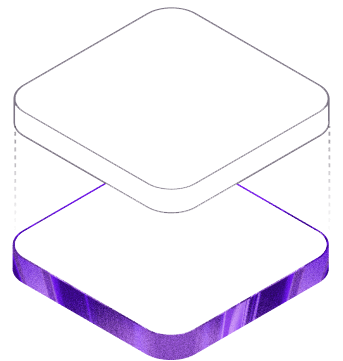

# SNMP Walk Explorer



## About

**SNMP Walk Explorer** is a DataMiner solution for reviewing and analyzing SNMP walk evidence collected across your network. It allows teams to safely inspect completed walk runs, navigate bounded OID hierarchies, perform fast binding searches, and download raw walk artifacts directly from a secure browser interface.

By separating collection execution from evidence analysis, the solution provides operators and developers with safe, read-only access to diagnostic MIB trees without requiring elevated direct access to the DataMiner Agent file system or running manual walk commands.

## Key Features

- **Evidence Dashboard**: Inspect completed walk bundles with protocol details, execution status, and root outcome health markers.
- **OID Tree Navigation**: Explore observed OID trees hierarchically with bounded traversal and branch binding counts.
- **Binding Search**: Rapidly filter and locate specific OIDs and parameter values across captured walk data.
- **Raw Evidence Export**: Securely download immutable `.walk` JSON Lines evidence files for offline analysis or simulation.
- **Walk Configurations**: Centrally manage non-secret SNMP collection settings and discovery roots stored in DataMiner DOM.

## Use Cases

- **Driver & Connector Development**: Validate real-world device MIB structures and OID responses without needing continuous live access to lab hardware.
- **Network Device Troubleshooting**: Compare walk runs across devices or firmware versions to isolate missing tables or unexpected OID timeouts.
- **Simulator Artifact Preparation**: Review and export verified walk evidence for feeding into device simulators such as QA Device Simulator.

## Prerequisites

- **DataMiner Version**: DataMiner `10.6.0.0-17344` or later (Main Release `10.6.0` CU7 or equivalent Feature Release).
- **QA Device Simulator Library**: `Skyline.DataMiner.QA.SNMP.dll` installed with DataMiner at `C:\Skyline DataMiner\Tools\QADeviceSimulator\Skyline.DataMiner.QA.SNMP.dll` on executing DMAs (standard inbox component; no separate simulator installation needed).
- **Web Access**: Modern web browser with DataMiner authentication session access.

## Technical Reference

After deploying the package, open the explorer interface using your DataMiner web session:

```text
{PROTOCOL}://{DOMAIN}/auth/?url=%2Fpublic%2FSLC-S-SNMPWalkBrowser%2Findex.html
```

Detailed technical documentation and repository resources:

- [SNMP Walk Explorer Source Repository](https://github.com/SkylineCommunications/SLC-S-SNMPWalkExplorer)
- [Collection Rules and Evidence Contract](https://github.com/SkylineCommunications/SLC-S-SNMPWalkExplorer/blob/main/docs/SNMP-Walk-Rules.md)
- [Operational Validation Guide](https://github.com/SkylineCommunications/SLC-S-SNMPWalkExplorer/blob/main/docs/Operational-Validation.md)
- [Contact DataMiner Technical Support](https://aka.dataminer.services/contacting-tech-support)